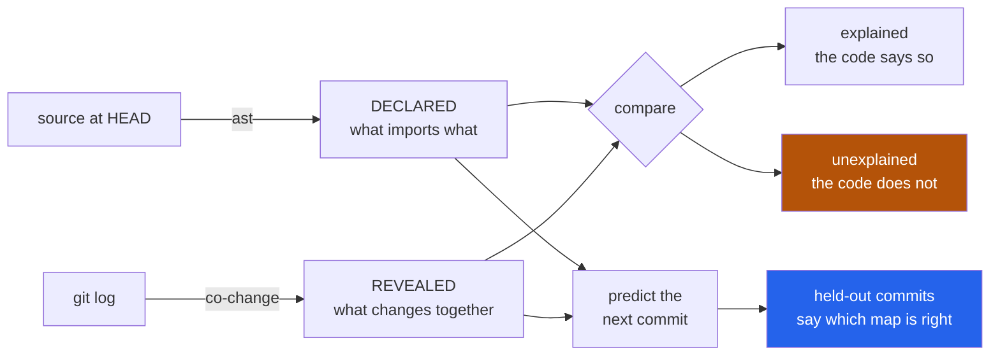

<h1 align="center">cartographer (Python · AST · git history · zero deps)</h1>
<p align="center"><i>The import graph is a claim about how a codebase is organised. The history is the evidence.</i></p>

<p align="center">
  <a href="#the-through-line">The through-line</a> &middot;
  <a href="#the-result">The result</a> &middot;
  <a href="docs/RESULTS.md">Full results</a> &middot;
  <a href="#how-it-works">How it works</a> &middot;
  <a href="#run-it">Run it</a> &middot;
  <a href="#what-this-does-not-do">What it does NOT do</a> &middot;
  <a href="#problems-hit-while-building-this">Problems hit</a>
</p>

<p align="center">
  <a href="https://github.com/hammasbuilds/cartographer/actions/workflows/ci.yml"></a>
  
  
  
  
  <a href="LICENSE"></a>
</p>

---

## The through-line



Every codebase has two maps. One is drawn in the source — module A imports module B. The
other is written in the history — these files keep changing in the same commit.

The first is the one people read. The second is the one they navigate by. **This measures how
far apart they are**, and then checks which one is actually right by asking both to predict
commits they have never seen.

## The result

Five projects, 7,873 commits, split **by time** — learn from the first 80%, predict the last
20%. The task: *given one file in a held-out commit, rank every other file in the repository
by how likely it is to be in that commit too.*

| repo | commits | frequency | imports | co-change | both |
|---|---:|---:|---:|---:|---:|
| click | 1,304 | 0.449 | 0.365 | **0.586** | 0.588 |
| requests | 2,814 | 0.577 | 0.599 | **0.634** | 0.630 |
| flask | 2,014 | 0.620 | 0.554 | **0.653** | 0.625 |
| httpx | 974 | 0.502 | 0.483 | 0.553 | **0.554** |
| packaging | 767 | 0.389 | 0.601 | 0.661 | **0.707** |

<sub>Mean reciprocal rank. `frequency` ignores the query and ranks by how often each file
changes — the "usual suspects" baseline.</sub>

Two things worth separating:

**Co-change beats the churn baseline on all five.** The history knows something about your
repository that `git log | sort | uniq -c` does not.

**The import graph loses to that baseline on three of five.** On click, guessing the busiest
files beats following the imports (0.449 vs 0.365). Structure is a worse predictor of what
you will have to change than a list of what people change a lot — except on `packaging`,
where it wins decisively, and where combining both is better than either alone.

### How much of the coupling the code explains

```
requests    76%   ####################
click       60%   ################
flask       60%   ################
packaging   57%   ###############
httpx       33%   #########
```

### The hypothesis I set out to confirm, and did not

The tool was built to find **hidden coupling**: pairs of files that change together with
nothing in the code connecting them — a wire format written in one and parsed in another, a
constant duplicated. Those are real, and it finds them:

```
  8 commits together   confidence 0.42   lift 7.2
      docs/conf.py
      src/packaging/__init__.py
```

But across five well-maintained libraries there are **almost none**:

| repo | nothing connects them | only via a package `__init__.py` |
|---|---:|---:|
| click | **0** | 57 |
| requests | 4 | 16 |
| flask | **0** | 100 |
| httpx | **0** | 147 |
| packaging | 13 | 26 |

Three of five have exactly zero. The unexplained coupling is real and large, but it is almost
all one thing: **two files in the same package, neither importing the other, both re-exported
by the package root.** The code records that they ship together and nothing else.

That is a smaller claim than the one I started with, and it is the one the measurement
supports. See [docs/RESULTS.md](docs/RESULTS.md).

## How it works

**The source is parsed, never imported.** Importing a repository to inspect it runs its
module-level code — side effects, missing dependencies, or both.

**Merges are excluded, renames are followed, huge commits are dropped.** A merge's file list
is the union of a whole branch. A renamed file whose history is split in two looks half as
coupled. One reformat touching 400 files asserts 79,800 pairwise couplings.

**Confidence for predicting, lift for reporting.** Confidence is asymmetric and answers
"I touched `a`, what else?". Lift divides out the base rate — a pair at 90% confidence and
lift 1.1 is telling you that `b` changes in 90% of all commits, which is a fact about `b`.

**Package roots do not count as a connection.** Through an `__init__.py` that re-exports its
modules, *every* file in a package is two hops from every other. Connectivity is computed
with those hubs removed.

**The split is by time, never at random.** Sampling commits at random lets a pair that
changed together in 2024 be learned from and predicted in 2019.

## Run it

```bash
git clone https://github.com/hammasbuilds/cartographer
cd cartographer
uv venv && uv pip install -e ".[dev]"

cartographer map /path/to/repo                    # the two maps, and where they disagree
cartographer map /path/to/repo --min-lift 3       # only strongly-coupled pairs
cartographer bench /path/to/repo                  # score both maps on held-out commits
cartographer map . --json docs/map.json
```

Needs no model, no API key, no GPU, and no runtime dependencies — `ast` reads the source and
`git log` reads the history. Works on a partial clone, and says so when rename detection was
unavailable.

## Layout

```
src/cartographer/
  history.py   git log -> commits; merges out, renames followed, sweeps dropped
  imports.py   AST import graph; resolving `from . import x` is the whole difficulty
  couple.py    co-change, with confidence and lift doing different jobs
  compare.py   where the maps disagree, and why hop distance had to be thrown away
  predict.py   four rankers, of which the churn baseline is the one that matters
  bench.py     score them on commits split off by time
  report.py    lead with the share the imports explain; it sets the rest
```

## What this does NOT do

- **It does not find hidden coupling in most repositories.** That was the premise, and the
  measurement is above: three of five have zero. The tool reports what it finds, which is
  usually "the package root is the only link", and that is a weaker statement.
- **Co-change is correlation.** Two files changing together may share a cause, or one may
  cause the other, or a single person may simply have tidied both. Nothing here distinguishes
  them.
- **Python only, and imports only.** A call through a plugin registry, a template, an entry
  point or a string-keyed dispatch table is invisible, and will look like unexplained
  coupling because it is unexplained *to this tool*.
- **It cannot tell a stable interface from a dead import.** Both are "imported, never changed
  together". The output is a list to read, not a verdict.
- **Thresholds are judgement calls.** `min_support=3`, `min_lift=2.0`, `max_files=30`. All
  three are printed with the results, and all three are flags.
- **Short histories give nothing.** Under a few hundred commits almost no pair clears the
  floors, and the report says that rather than reporting a clean repository.
- **The import graph is read at HEAD** — after the test period. That advantage goes to the
  import ranker, and it still loses on three of five.

## Problems hit while building this

- **Deleted files ranked above every real finding.** A file removed two years ago has no
  import edges, so "nothing in the code connects them" was trivially true for every pair
  involving one. On click, all six top findings were pairs of files that no longer existed —
  ranked first precisely because nothing could possibly connect them.
- **The resolver sent most internal imports to the wrong file.** `from . import certs` names
  the *package* in its text and the *submodule* in its intent, and I resolved the text first.
  Since that is the commonest import form inside a package, most of a project's internal
  edges landed on its package root. It hid `requests`'s `utils.py -> certs.py` edge
  completely — which then surfaced as the **top hidden-coupling finding**, at 0.70
  confidence. A bug in my parser, reported as a discovery about somebody else's code.
- **Hop distance measured nothing.** Calling a pair "hidden" at three or more import-hops
  gave sensible answers on click and nothing but test/subject pairs on flask and httpx.
  Through a re-exporting `__init__.py` every file in a package is two hops from every other,
  so the metric was reporting *"these files are in the same package"* — which was never in
  question.
- **A 200-second benchmark that should have taken one.** `neighbours()` scanned all 170 edges
  per lookup, inside a breadth-first search, inside a loop over 400 queries. One cached
  adjacency map took it to 0.6s, which is the difference between five repositories and one.
- **`git log -M` needs the network on a partial clone.** Rename detection compares file
  *contents*, so on a `--filter=blob:none` clone it reaches for blobs that were never
  downloaded and the entire log fails. It now falls back to `--no-renames` and says so,
  because an understated map beats a crash.

## Also worth reading

| | |
|---|---|
| &#128202; **[Results](docs/RESULTS.md)** | Five repositories in full, with the thresholds |
| **[flake-detective](https://github.com/hammasbuilds/flake-detective)** | Which variable a flaky test actually depends on |
| **[blast-radius](https://github.com/hammasbuilds/blast-radius)** | What a dependency upgrade actually changes |
| **[suite-auditor](https://github.com/hammasbuilds/suite-auditor)** | What a passing test suite does not check |
| **[pr-referee](https://github.com/hammasbuilds/pr-referee)** | Whether a diff changes behaviour, by running both sides |

## Keywords

code analysis &middot; import graph &middot; logical coupling &middot; co-change &middot;
change coupling &middot; git history mining &middot; software architecture &middot;
dependency graph &middot; AST &middot; repository mining &middot; MSR &middot; python

## License

MIT - see [LICENSE](LICENSE).
